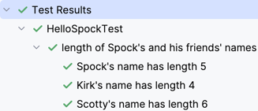

# Kotlin Datatable Plugin

brings back the iconic flaver of [spockframeworks](https://spockframework.org/) datatables. 

```kotlin
import de.nielsfalk.dataTables.Data
import io.kotest.core.spec.style.FreeSpec
import io.kotest.matchers.shouldBe

class HelloSpockTest : FreeSpec({
    "length of Spock's and his friends' names" - {
        @Data("name"   , "expectedLength") Spock {
              "Spock"  ǀ 5
              "Kirk"   ǀ 4
              "Scotty" ǀ 6
        }.each {
            "${name}'s name has length $expectedLength" {
                name.length shouldBe expectedLength
            }
        }
    }
})
```

The report will look like this:



## How it works

With writing and executing 
```kotlin
@Data("yourVal1", "yourVal2") YourGeneratedDataClass {
}
```
the ```fun <...> YourGeneratedDataClass(...)``` is generated and will return a ```List<YourGeneratedDataClass>```. The YourGeneratedDataClass Dataclass with its two named attributes is also generated. Now you can begin declaring your data in the curly braces.
```kotlin
"Spock"  ǀ 5
"Kirk"   ǀ 4
```
> ⚠️ Since it is not possible to overwrite the pipe operator in kotlin ```ǀ``` is used because it almost looks like ```|```

For parameterized tests it is recommended to separate in- and output parameters with ```ǀǀ```

The list can be iterated in the context of the data-row with the ```each``` function.
```kotlin
.each {
    println("yourVal1 = ${yourVal1}")
}
```
Types are inferred.

## Kotlin Proposal

@Jetbrains Please implement the possibility to overwrite the pipe operator and if you want to make this plugin obsolete and bring Spock-Syntax as an official compiler plugin with its automatic formatting as you did it back than with the real Spockframework and the IntelliJ-Groovy-Plugin. I'd appreciate it :)

## Use it in your project

> ⚠️ Until the plugin is not published to mavenCentral it is required to push the plugin to you local cache 
`./gradlew :data-table-plugin:publishToMavenLocal`

In your build.gradle.kts you need to add the plugin
```kotlin
plugins {
    id("de.nielsfalk.kotlin.data-table-plugin") version "0.1.0"
}

tasks.named("compileKotlin") {
    dependsOn("scanDataTables")
}
```
And now you can start writing and executing
```kotlin
@Data("val1", "val2") YourGeneratedDataClass {
      "one" ǀ "two"
}
```
For nice reformatting execute

`./gradlew formatDataTables`

