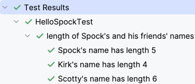

# Kotlin Datatable Plugin

brings back the iconic flaver of [spockframeworks](https://spockframework.org/) datatables. 

```kotlin
import de.nielsfalk.dataTables.Data
import io.kotest.core.spec.style.FreeSpec

class HelloSpockTest : FreeSpec({
    "length of Spock's and his friends' names" - {
        @Data("name"   , "expectedLength") Spock {
              "Spock"  ǀ 5
              "Kirk"   ǀ 4
              "Scotty" ǀ 6
        }.each {
            "${name}'s name has length $expectedLength" {
                assert(name.length == expectedLength)
            }
        }
    }
})
```

The report will look like this:



## How it works

With writing and executing 
```kotlin
@Data("yourVal1", "yourVal2") YourGeneratedDataClass {
}
```
the ```fun <...> YourGeneratedDataClass(...)``` is generated and will return a ```List<YourGeneratedDataClass>```. The YourGeneratedDataClass Dataclass with its two named attributes is also generated. Now you can begin declaring your data in the curly braces.
```kotlin
"Spock"  ǀ 5
"Kirk"   ǀ 4
```
> ⚠️ Since it is not possible to overwrite the pipe operator in kotlin ```ǀ``` is used because it almost looks like ```|```

For parameterized tests it is recommended to separate in- and output parameters with ```ǀǀ```

The list can be iterated in the context of the data-row with the ```each``` function.
```kotlin
.each {
    println("yourVal1 = ${yourVal1}")
}
```
Types are inferred.

## Kotlin Proposal

@Jetbrains Please implement the possibility to overwrite the pipe operator and if you want to make this plugin obsolete and bring Spock-Syntax as an official compiler plugin with its automatic formatting as you did it back than with the real Spockframework and the IntelliJ-Groovy-Plugin. I'd appreciate it :)

## Use it in your project

In your build.gradle.kts you need to add the plugin
```kotlin
plugins {
    id("io.github.nielsfalk.datatable") version "0.2.1"
}

tasks.named("compileKotlin") {
    dependsOn("generateDataTables")
}
```
And now you can start writing and executing
```kotlin
@Data("val1", "val2") YourGeneratedDataClass {
      "one" ǀ "two"
}
```
For nice reformatting execute

`./gradlew formatDataTables`

## samples

 - [jvm sample](samples/data-table-sample-jvm/)
 - [kmp sample](samples/data-table-sample-kmp/)


## Suggested Snippet for AGENTS.md or GUIDELINES.md

with the following snippet your coding-agent should produce state of the art tests
````markdown
# Guidelines

## Technical Guideline

### Testing

— Use **Kotest** `FreeSpec` style for all tests.
— **You MUST enable and use Kotlin power asserts.** Add the `org.jetbrains.kotlin.plugin.power-assert` plugin (same version as Kotlin) to the plugins block. Use `assert(condition)` for boolean assertions — the compiler renders intermediate expression values on failure, giving far better diagnostics than `shouldBe`. This is mandatory, not optional.
— Use the **Kotlin Datatable Plugin** (`io.github.nielsfalk.datatable`).
  — Always run `./gradlew formatDataTables` after touching data tables.
  — Use data tables whenever test cases have similarity or similar assertions would follow each other. Feel free to add descriptions to the case or container name.

### Test Structure

Tests must contain empty lines to separate **given** (optional), **when**, and **then** blocks. These blocks must **not** be named or commented.

```kotlin
"paper player always chooses paper" {
    val player = PaperPlayer()

    val choice = player.choose()

    assert(choice == Paper)
}
```
````
